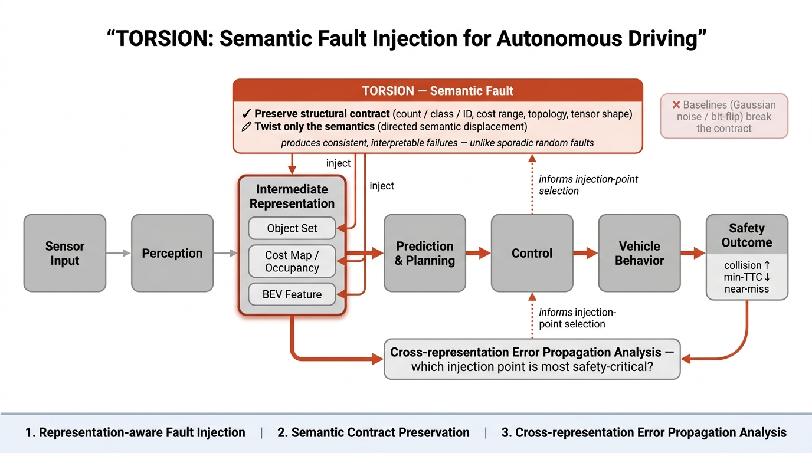

# TORSION

**A Semantic Fault Propagation Characterization framework for autonomous-driving systems.**

TORSION injects **semantic faults** as *excitation signals* into an autonomous-driving pipeline and
**empirically identifies how errors propagate** across its intermediate representations — which
representation boundaries *amplify* an error into a safety failure, which *attenuate* it, and **why**.

> Fault injection is the **tool**; error propagation is the **observation**; characterization is the
> **result**; (empirical) system identification is the **methodology**.



*(Conceptual overview. The precise pipeline studied and its measured interface gains are shown below.)*

---

## The pipeline and its measured propagation response

```
 Semantic Fault  (excitation — injected at a chosen representation)
       │
  [object] ──2.09──▶ [prediction] ──0.004──▶ [cost-map] ──10–40──▶ [plan] ──2.3──▶ [control] ──▶ Safety
             amplify              attenuate               amplify            (linear)
          (CV integration)    (rasterization)         (argmin switch)
```

Each arrow is an **interface gain** (>1 amplifies, <1 attenuates). Two structural facts hold in both
synthetic and **real (nuPlan)** data:

- **Rasterization boundaries attenuate** — projecting object/prediction state onto a grid is a
  many-to-one, kernel-limited map (local Jacobian ≈ 0.02–0.04 ≪ 1).
- **The cost-map is the most safety-critical representation interface** — injecting there degrades safety
  far more than at the object stage, at matched budget.

---

## What is a "semantic fault"?

A fault that **preserves the structural contract** of a representation (object count / class / track-ID,
cost-value range, drivable topology, tensor shape) while **twisting only its meaning** — e.g. displacing a
tracked object's position / velocity / heading. This models realistic errors (tracking drift, calibration
error, occupancy / segmentation error) and, unlike Gaussian noise or bit-flips (which *break* the contract
and serve as baselines), the faulted representation stays a *valid* input, so its propagation can be
observed.

---

## Key findings (honest — positive and negative)

Measured on a shared synthetic closed-loop harness (30 seeds), a real learned model (InterFuser BEV),
real CARLA (450 episodes), and **real nuPlan** (real HD map + real agents, 10,440 runs).

**Mechanisms — *why* each boundary behaves as it does**

| # | Boundary | Behaviour | Structural cause | Evidence |
|---|----------|-----------|------------------|----------|
| M1 | rasterization (→ cost-map) | attenuator | many-to-one grid projection | local Jacobian 0.02–0.04 ≪ 1 |
| M2 | cost-map → plan | amplifier | **sampling-argmin decision-boundary switching** | min-margin quartile: plan deviation ×27, argmin-flip ×24, Spearman ρ=0.52 |
| M3 | object → prediction | amplifier | constant-velocity integration over horizon | ∂pred/∂v = t; analytic = empirical; ∝ horizon |

**System characterization**

- **Propagation response (amplitude sweep):** `cost→plan` is a *nonlinear* switching element; `plan→control`
  and `object→prediction` are *linear* elements. The pipeline is a cascade of linear transfer elements with the
  **planner (argmin) as the critical nonlinearity**.
- **Failure taxonomy (810 runs):** across every fault origin, ~76–85% of faults route through a planner
  switch; the dominant induced failure is a phantom / hard brake; collision rate is highest for cost-map faults
  (11.9%) > object (5.2%) > prediction (0.4%).
- **Causal control:** softening the planner's selection (argmin → softmax) cuts switching by 36% and drives
  object / cost-map collisions to ~0 — **discrete selection amplifies, continuous selection is safer.**

**Generalization to real data (nuPlan open-loop, real map + real agents)**

| Claim | Reproduces on real data? |
|-------|--------------------------|
| Rasterization attenuates (object→cost gain ≪ 1) | **Yes** — robust, all scenario categories |
| Cost-map is the most safety-critical interface | **Yes** — robust, all categories |
| Planner amplifies (cost→plan > 1) | Partial — clear in car-following, weak in dense intersections |
| Planner-switch is a "universal gateway" | **No** — argmin-flip collapses 0.89 (sparse) → 0.02–0.23 (dense real) |
| Directed > random in raw strength | **No** — the robust distinction is *consistency*, not strength |

> The **core characterization (rasterization = attenuator, cost-map = most-critical interface) generalizes
> to real data.** The planner-switch "gateway" is a mechanism observed in **sparse / argmin-planner** settings,
> not a universal law. These bounds are stated explicitly rather than overclaimed.

---

## Repository layout

```
torsion/
  operators/     object / cost-map / BEV / twist / temporal semantic-fault operators (contract-preserving)
  scenarios/     unified closed-loop pipeline, cost-map & sampling/potential-field planners, CV prediction
  analysis/      propagation metrics, mechanism (Jacobian / decision-margin), transfer response, failure taxonomy
  data/          nuPlan (.db) + nuScenes adapters, nuPlan HD-map (gpkg) road-prior, shared geometry
  metrics/       safety (min-TTC, collision), statistics (bootstrap CI)
scripts/         run_* drivers for each experiment
tests/           unit + integration tests
configs/         experiment configs
```

Design / results write-ups: `TORSION_experiment_design.md`, `TORSION_framing.md`,
`TORSION_results_summary.md` (all numeric results, §4.1–4.14), `TORSION_발표정리.md` (talk summary).

---

## Reproducing

```bash
# environment (Python 3.12)
conda create -n torsion python=3.12 && conda activate torsion
pip install -e .            # numpy, etc.  (nuPlan path also needs: pip install shapely pyproj)

# tests
conda run -n torsion pytest -q

# a few experiments
python scripts/run_propagation_analysis.py --seeds 30                   # CIS / interface gains
python scripts/run_mechanism_analysis.py --seeds 30                     # M1 / M2 / M3
python scripts/run_transfer_function.py --seeds 25 --use-prediction     # linear/nonlinear response
python scripts/run_failure_taxonomy.py --seeds 30                       # propagation-path taxonomy
python scripts/run_planner_independence.py --seeds 20 --use-prediction  # sampling vs potential-field
python scripts/run_nuplan_propagation.py --n-frames 150                 # real-data generalization (nuPlan)
```

Large assets are intentionally not versioned: model weights, vendored `third_party/InterFuser`, and the
nuPlan / nuScenes datasets are obtained separately and placed locally.

---

## Status

Research code accompanying an in-progress paper. Target venues: IEEE T-ITS / T-IV.
Findings are reported with their honest scope; the metrics (interface gain, FAR, CIS, reach-safety) are
analysis tools defined for this framework, used to *observe* the reported phenomena — not claimed as general
laws.
