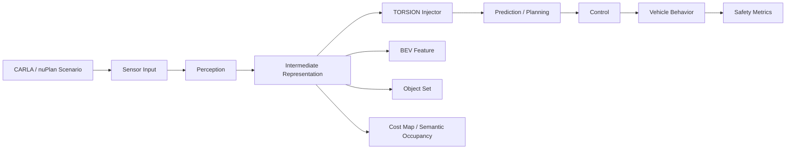

# TORSION 실험 설계서

## 0. 문서 목적

본 문서는 **TORSION: Algorithm-Aware Semantic Fault Injection for Autonomous Driving**의 1차 MVP 실험 설계를 정리한 문서입니다.

TORSION은 MARSHAL과 독립적인 연구 주제로 다룹니다. MARSHAL은 별도 벤치마크/평가 프레임워크로 분리하고, TORSION은 **자율주행 중간 표현에 대한 의미론적 fault injection 프레임워크**로 정의합니다.

---

## 1. 핵심 아이디어

### 1.1 한 줄 정의

> TORSION은 자율주행 파이프라인의 중간 표현을 무작위로 깨뜨리는 대신, 표현의 구조적 문법은 유지하면서 의미를 국소적으로 비틀어 downstream 안전 실패를 유도·분석하는 알고리즘 인지형 fault injection 프레임워크입니다.

### 1.2 핵심 철학: Representation Contract

자율주행 파이프라인의 각 모듈은 다음 모듈에게 **정해진 형식의 중간 표현**을 넘겨줍니다. 이 표현이 반드시 지켜야 하는 구조적 규약을 **Representation Contract(표현 계약)**라 부릅니다.

```text
Perception
   ↓  Object Set        (Contract: object count / class / track ID / 물리적 유효성)
Prediction
   ↓  Trajectory Set    (Contract: kinematic feasibility / lane association)
Planning
   ↓  Cost Map          (Contract: cost range / drivable topology / obstacle ordering)
Control
```

TORSION의 정의는 바로 여기서 기존 fault injection과 갈립니다.

| 관점 | Representation Contract | 무엇을 바꾸나 |
|---|---|---|
| Gaussian Noise / Bit-flip | ❌ **계약 자체를 깨뜨림** | 값을 무작위로 오염 |
| **TORSION** | ✅ **계약은 유지** | 계약 **내부에서 의미(semantic)만** 국소적으로 비틈 |

> TORSION은 표현 계약을 깨뜨리는 것이 아니라, **계약을 만족하는 유효한 표현 공간 안에서 의미만 비틀어** downstream 오류 전파를 유도한다.

이 "**contract는 유지, semantic만 비튼다**"는 구분이 TORSION을 random fault injection과 구별하는 핵심 정체성이며, 논문 전체를 관통하는 철학입니다. 4.4장의 의미 보존 조건과 각 실험의 의미 보존 제약(A.4/B.4/C.4)은 바로 이 계약을 표현 공간별로 형식화한 것입니다.

### 1.3 기존 Fault Injection과의 차이

| 구분 | 기존 Fault Injection | TORSION |
|---|---|---|
| 주입 단위 | bit, weight, activation, sensor noise, delay | BEV feature, object set, cost map, semantic occupancy |
| 교란 방식 | random corruption 또는 low-level fault | semantic / geometric / algorithm-aware twist |
| 주요 목적 | 하드웨어/소프트웨어 오류 영향 평가 | 중간 표현 오류의 safety-critical propagation 분석 |
| 해석성 | 낮거나 불규칙함 | 어떤 표현 계약이 깨졌는지 해석 가능 |
| 평가 중심 | accuracy, mission success, crash 여부 | closed-loop safety degradation + error propagation mechanism |

### 1.4 핵심 가설

```text
H1. TORSION은 Gaussian noise나 bit-flip보다 더 작은 perturbation으로도 큰 closed-loop safety degradation을 유도할 수 있다.

H2. 자율주행 파이프라인의 중간 표현 중 BEV feature, object set, cost map은 error propagation에 특히 민감하다.

H3. 같은 magnitude의 fault라도 주입 위치와 표현 공간에 따라 downstream 위험도가 크게 달라진다.
```

---

## 2. 연구 범위

### 2.1 포함 범위

TORSION 1차 MVP는 다음 3개 주입 지점을 다룹니다.

```text
1. BEV Feature Torsion
2. Object-set Torsion
3. Cost-map / Semantic Occupancy Torsion
```

### 2.2 제외 범위

1차 논문에서는 아래 항목을 핵심 기여에서 제외합니다.

```text
- 실제 도로 실험
- 차량 ECU / CAN bus 공격
- 물리 센서 spoofing
- hardware laser fault attack
- rowhammer / voltage glitching
- MARSHAL과의 통합
- full adversarial attack benchmark화
```

해당 항목은 후속 연구 또는 appendix 수준으로만 언급합니다.

---

## 3. 시스템 개요



TORSION은 sensor input 자체보다 **perception 이후의 중간 표현**에 주입하는 것을 우선합니다. 이유는 다음과 같습니다.

```text
- 입력 이미지 수준 fault는 너무 저수준이고 노이즈 해석이 섞임
- control command 수준 fault는 너무 결과에 가까움
- 중간 표현은 perception, prediction, planning 사이의 계약을 드러냄
- downstream 오류 전파를 분석하기 가장 좋음
```

---

## 4. 수학적 정의

### 4.1 자율주행 파이프라인

자율주행 파이프라인을 다음과 같이 둡니다.

$$
z_0 = x
$$

$$
z_k = f_k(z_{k-1}; \theta_k)
$$

$$
u = g(z_K)
$$

여기서:

| 기호 | 의미 |
|---|---|
| $x$ | sensor input |
| $z_k$ | k번째 중간 표현 |
| $f_k$ | perception / prediction / planning module |
| $u$ | 최종 control command |
| $g$ | control policy 또는 planner-control interface |

### 4.2 TORSION 연산자

TORSION은 특정 중간 표현 공간 $\mathcal{Z}_k$에서 작동하는 연산자입니다.

$$
T^{(k)}_\phi: \mathcal{Z}_k \rightarrow \mathcal{Z}_k
$$

주입 후 표현은 다음과 같습니다.

$$
\tilde{z}_k = T^{(k)}_\phi(z_k; c)
$$

이후 downstream은 corrupted representation을 입력으로 받습니다.

$$
\tilde{z}_{j+1} = f_{j+1}(\tilde{z}_j; \theta_{j+1}), \quad j \geq k
$$

여기서:

| 기호 | 의미 |
|---|---|
| $\phi$ | torsion parameter |
| $c$ | scenario context, actor 위치, lane 위치 등 |
| $T^{(k)}_\phi$ | 표현 공간별 torsion operator |

### 4.3 최적화 관점

TORSION의 목적은 단순히 표현을 크게 망가뜨리는 것이 아니라, 의미 보존성을 유지하면서 safety loss를 증가시키는 것입니다.

$$
\max_{\phi \in \Phi}
\mathcal{L}_{safety}(\tau(\phi))
- \lambda_1 d_{sem}(z_k, \tilde{z}_k)
- \lambda_2 \|\phi\|_2^2
$$

제약 조건:

$$
d_{geom}(z_k, \tilde{z}_k) \leq \epsilon_g
$$

$$
d_{sem}(z_k, \tilde{z}_k) \leq \epsilon_s
$$

$$
d_{temp}(\tilde{z}_{k,1:T}) \leq \epsilon_t
$$

### 4.4 의미 보존 조건

| 표현 공간 | 의미 보존 조건 예시 |
|---|---|
| BEV feature | lane topology 유지, drivable area topology 유지, local smoothness 유지 |
| Object set | object count 유지, class 유지, track ID 유지, bbox 크기 과도 변화 금지 |
| Cost map | obstacle ordering 유지, drivable envelope 유지, cost range 유지 |
| Trajectory | kinematic feasibility 유지, lane association 유지 |

---

## 5. TORSION-MVP의 세 가지 실험

# Experiment A. Object-set Torsion

## A.1 목적

Perception 또는 tracking output의 객체 표현을 의미론적으로 비틀었을 때, prediction과 planning이 어떻게 실패하는지 분석합니다.

## A.2 주입 위치

```text
Perception Output / Tracking Output
→ Object Set
→ Prediction / Planning
```

객체 표현:

$$
O = \{o_i\}_{i=1}^{N}
$$

$$
o_i = (x_i, y_i, z_i, w_i, h_i, l_i, \psi_i, v_i, cls_i, conf_i)
$$

## A.3 TORSION 연산자

### A.3.1 Position Torsion

$$
\tilde{x}_i = x_i + \Delta x
$$

$$
\tilde{y}_i = y_i + \Delta y
$$

### A.3.2 Yaw Torsion

$$
\tilde{\psi}_i = \psi_i + \Delta \psi
$$

### A.3.3 Velocity Direction Torsion

$$
\tilde{v}_i = R_\theta v_i
$$

### A.3.4 Confidence Redistribution

$$
\tilde{conf}_i = conf_i + \Delta conf_i
$$

단, class와 track ID는 유지합니다.

## A.4 의미 보존 제약

```text
- object count 유지
- object class 유지
- track ID 유지
- bbox size는 일정 범위 내에서만 변경
- 물리적으로 불가능한 속도/위치 변화 금지
```

## A.5 시나리오

| Scenario | 설명 | 기대 실패 |
|---|---|---|
| Leading Vehicle | 앞차 추종 | braking delay |
| Cut-in Vehicle | 옆 차선 차량 끼어들기 | wrong yield / collision |
| Pedestrian Crossing | 보행자 횡단 | late braking |
| Intersection Left Turn | 교차로 좌회전 | gap misjudgment |
| Static Obstacle | 정차 차량 회피 | unsafe passing |

## A.6 측정 지표

| Metric | 의미 |
|---|---|
| Collision Rate | 충돌 비율 |
| Minimum TTC | 최소 time-to-collision |
| Minimum Actor Distance | 주변 객체와의 최소 거리 |
| Brake Reaction Delay | fault 후 brake command까지 지연 |
| Prediction Error | 예측 궤적 변화량 |
| Route Completion | 경로 완주율 |
| Recovery Time | 정상 궤적으로 복귀하는 시간 |

## A.7 기대 결과

```text
Object-set torsion은 작은 위치/yaw/velocity 왜곡만으로도
prediction과 planner의 판단을 크게 바꿀 수 있다.
```

가장 논문 그림이 잘 나오는 실험입니다.

---

# Experiment B. Cost-map / Semantic Occupancy Torsion

## B.1 목적

Planner가 사용하는 cost map 또는 semantic occupancy map을 비틀었을 때, trajectory generation과 vehicle behavior가 어떻게 실패하는지 분석합니다.

## B.2 주입 위치

```text
Semantic Occupancy / Cost Map
→ Planner
→ Control
```

표현:

$$
C \in \mathbb{R}^{H \times W}
$$

또는

$$
S \in \mathbb{R}^{K \times H \times W}
$$

여기서 $K$는 semantic class 수입니다.

## B.3 TORSION 연산자

### B.3.1 Spatial Cost Warp

$$
\tilde{C}(p) = C(T^{-1}_\phi(p))
$$

### B.3.2 Directional Obstacle Inflation

$$
\tilde{C}(p) = C(T^{-1}_\phi(p)) + \beta G(p; \mu, \Sigma, \rho)
$$

### B.3.3 Obstacle Deflation

$$
\tilde{C}(p) = C(p) - \beta G(p; \mu, \Sigma)
$$

### B.3.4 Lane Boundary Shear

$$
T(s,n) = (s, n + \kappa(s-s_0)^2 e^{-\frac{(s-s_0)^2}{\sigma^2}})
$$

여기서 $(s,n)$은 Frenet 좌표입니다.

## B.4 의미 보존 제약

```text
- cost value range 유지
- drivable area topology는 과도하게 파괴하지 않음
- obstacle ordering은 가능한 유지
- cost map 전체를 random하게 망가뜨리지 않음
- 국소 region 중심으로 변형
```

## B.5 시나리오

| Scenario | 설명 | 기대 실패 |
|---|---|---|
| Narrow Road Obstacle | 좁은 길 장애물 회피 | unsafe squeeze-through |
| Crosswalk | 횡단보도 접근 | pedestrian risk underestimation |
| Intersection | 교차로 통과 | wrong path selection |
| Construction Zone | 공사 구간 회피 | off-road / deadlock |
| Parked Vehicle | 정차 차량 옆 통과 | insufficient clearance |

## B.6 측정 지표

| Metric | 의미 |
|---|---|
| Collision Rate | 충돌 비율 |
| Off-road Rate | 주행 가능 영역 이탈률 |
| Lane Departure Rate | 차선 이탈률 |
| Deadlock Rate | 비정상 정지/정체 비율 |
| Unnecessary Stop Time | 불필요 정지 시간 |
| Minimum Obstacle Distance | 장애물과 최소 거리 |
| Path Curvature | 생성 궤적 곡률 변화 |
| Comfort Score | 승차감 관련 jerk/acceleration 변화 |

## B.7 기대 결과

```text
Cost-map torsion은 perception metric에는 잘 드러나지 않지만,
planner의 위험 판단을 직접 왜곡하여 closed-loop failure를 강하게 유도할 수 있다.
```

이 실험은 planning failure를 가장 직접적으로 보여줍니다.

---

# Experiment C. BEV Feature Torsion

## C.1 목적

BEV 기반 중간 feature를 비틀었을 때 perception, map understanding, planning으로 이어지는 오류 전파를 분석합니다.

## C.2 주입 위치

```text
Backbone / Encoder
→ Shared BEV Feature
→ Detection / Mapping / Planning Head
```

표현:

$$
Z_{bev} \in \mathbb{R}^{C \times H \times W}
$$

## C.3 TORSION 연산자

### C.3.1 BEV Spatial Warp

$$
\tilde{Z}_{bev}(p) = Z_{bev}(T^{-1}_\phi(p))
$$

### C.3.2 Local Rotation

$$
T(p) = c + R_\theta(p-c)
$$

### C.3.3 Local Shear

$$
T(p) = c + A_s(p-c)
$$

$$
A_s =
\begin{bmatrix}
1 & s_x \\
s_y & 1
\end{bmatrix}
$$

### C.3.4 Diffeomorphic-like Local Twist

$$
T(p) = p + \alpha G(p;c,\sigma) V(p)
$$

여기서 $G$는 local support function이고, $V(p)$는 회전 또는 전단 방향의 vector field입니다.

## C.4 의미 보존 제약

```text
- BEV grid 크기 유지
- feature tensor shape 유지
- local smoothness 유지
- global frame 전체 붕괴 금지
- 작은 magnitude부터 점진적으로 증가
```

## C.5 시나리오

| Scenario | 설명 | 기대 실패 |
|---|---|---|
| Lane Following | 직선 차선 주행 | lane drift |
| Curved Lane | 곡선 차선 주행 | trajectory deviation |
| Intersection | 교차로 통과 | route bias |
| Cut-in | 끼어들기 상황 | actor misalignment |
| Pedestrian Crossing | 횡단보도 | false free-space |

## C.6 측정 지표

| Metric | 의미 |
|---|---|
| Detection mAP / NDS | perception degradation |
| Lane IoU | map/lane representation 변화 |
| BEV Feature Distance | feature-level 변화량 |
| Trajectory Deviation | 계획 궤적 변화 |
| Collision Rate | 충돌률 |
| Minimum TTC | 최소 TTC |
| Route Completion | 경로 완주율 |

## C.7 기대 결과

```text
BEV feature torsion은 lane/object spatial alignment를 깨뜨려
planner route bias와 trajectory deviation을 유도할 수 있다.
```

구현 난이도는 세 실험 중 가장 높지만, TORSION의 핵심 아이디어를 가장 잘 보여줍니다.

---

## 6. Baseline 설계

TORSION의 효과를 보이려면 반드시 기존 fault injection baseline과 비교해야 합니다.

| Baseline | 설명 | 목적 |
|---|---|---|
| Clean | fault 없음 | 정상 성능 기준 | 
| Gaussian Noise | feature 또는 representation에 random noise | random perturbation 대비 |
| Bit Flip / Activation Corruption | activation bit 또는 값 일부 변조 | low-level fault 대비 |
| Sensor Noise | camera/LiDAR input noise | sensor-level fault 대비 |
| Random Spatial Warp | 의미 보존 제약 없는 random warp | structured torsion 대비 |
| TORSION | semantic-preserving structured twist | 제안 기법 |

핵심 비교 문장은 다음과 같습니다.

```text
TORSION is not merely stronger noise; it is more semantically targeted and structurally valid.
```

---

## 7. 실험 매트릭스

### 7.1 전체 후보 매트릭스

| 축 | 후보 |
|---|---|
| Injection Point | Object-set, Cost-map, BEV Feature |
| Operator | Rotation, Shear, Curvature Warp, Inflation/Deflation |
| Magnitude | 0.00, 0.05, 0.10, 0.20, 0.30 |
| Temporal Pattern | Single-frame, Burst, Persistent, Drift |
| Scenario Type | Lane following, Intersection, Cut-in, Pedestrian crossing, Obstacle avoidance |
| Seed | 5~10 seeds |

### 7.2 MVP 최소 실험 규모

1차 결과는 아래 정도로 충분합니다.

```text
3 injection points
× 3 magnitudes
× 4 scenario types
× 5 seeds
= 180 runs
```

추천 구성:

| 요소 | 값 |
|---|---|
| Injection Points | Object-set, Cost-map, BEV Feature |
| Magnitudes | Low, Medium, High |
| Scenario Types | Cut-in, Pedestrian crossing, Intersection, Obstacle avoidance |
| Seeds | 5 |
| Total Runs | 180 |

### 7.3 확장 실험

논문 결과가 잘 나오면 다음을 추가합니다.

```text
- temporal pattern ablation
- operator family ablation
- scenario difficulty ablation
- transferability across models
- CARLA → nuPlan generalization
```

---

## 8. Fault Magnitude 정의

### 8.1 Object-set Magnitude

| Level | Position Shift | Yaw Shift | Velocity Rotation |
|---|---:|---:|---:|
| Low | 0.2 m | 2° | 2° |
| Medium | 0.5 m | 5° | 5° |
| High | 1.0 m | 10° | 10° |

### 8.2 Cost-map Magnitude

| Level | Warp Strength | Cost Inflation/Deflation |
|---|---:|---:|
| Low | 0.05 | 10% |
| Medium | 0.10 | 25% |
| High | 0.20 | 50% |

### 8.3 BEV Feature Magnitude

| Level | Rotation | Shear | Local Support Radius |
|---|---:|---:|---:|
| Low | 2° | 0.05 | small |
| Medium | 5° | 0.10 | medium |
| High | 10° | 0.20 | medium-large |

실제 값은 모델/시뮬레이터에 따라 pilot run 후 보정합니다.

---

## 9. Temporal Fault Pattern

| Pattern | 설명 | 예시 |
|---|---|---|
| Single-frame | 한 프레임만 fault 주입 | transient perception glitch |
| Burst | N 프레임 연속 주입 | sensor/model instability |
| Persistent | episode 동안 유지 | calibration-like bias |
| Drift | 시간이 지나며 점진 증가 | accumulated localization/feature drift |
| Actor-locked | 특정 actor 주변에만 유지 | cut-in vehicle, pedestrian 중심 fault |

1차 실험에서는 아래 3개만 우선 사용합니다.

```text
1. Single-frame
2. Burst
3. Persistent
```

Drift와 Actor-locked는 후속 ablation에 넣습니다.

---

## 10. 평가 지표

### 10.1 Closed-loop Safety Metrics

| Metric | 방향 | 설명 |
|---|---|---|
| Collision Rate | 낮을수록 좋음 | 충돌 발생 비율 |
| Minimum TTC | 높을수록 좋음 | 가장 위험했던 순간의 TTC |
| Minimum Actor Distance | 높을수록 좋음 | 주변 actor와 최소 거리 |
| Lane Departure Rate | 낮을수록 좋음 | 차선 이탈 비율 |
| Off-road Rate | 낮을수록 좋음 | 주행 가능 영역 이탈률 |
| Route Completion | 높을수록 좋음 | 경로 완주율 |
| Recovery Time | 낮을수록 좋음 | fault 후 안정 상태 복귀 시간 |

### 10.2 Planning Metrics

| Metric | 설명 |
|---|---|
| Trajectory L2 Deviation | clean trajectory 대비 계획 궤적 변화 |
| Path Curvature Change | 곡률 변화량 |
| Jerk / Acceleration | 승차감 및 control smoothness |
| Planner Failure Rate | planner가 valid trajectory를 생성하지 못한 비율 |
| Deadlock Rate | 불필요 정지 또는 진행 불능 |

### 10.3 Representation Preservation Metrics

| 표현 | Metric |
|---|---|
| BEV Feature | feature L2 distance, cosine distance, local smoothness |
| Object Set | assignment consistency, class consistency, object count preservation |
| Cost Map | cost distribution shift, drivable area IoU, obstacle ordering consistency |

### 10.4 핵심 결과 지표

논문 main table에는 아래 5개만 우선 넣습니다.

```text
1. Collision Rate
2. Minimum TTC
3. Route Completion
4. Lane / Off-road Violation
5. Recovery Time
```

---

## 11. 분석 방법

### 11.1 Magnitude-response Curve

각 torsion magnitude에 대해 safety degradation을 측정합니다.

```text
x-axis: torsion magnitude
 y-axis: collision rate, min TTC, route completion
```

목표:

```text
작은 semantic torsion도 safety-critical failure를 유도하는지 확인
```

### 11.2 Injection Point Sensitivity

세 주입 지점의 위험도를 비교합니다.

```text
Object-set vs Cost-map vs BEV Feature
```

예상:

```text
Cost-map torsion: planning failure에 가장 직접적
Object-set torsion: 해석 가능성이 가장 높음
BEV feature torsion: end-to-end model 취약성 분석에 가장 강함
```

### 11.3 Scenario-wise Failure Heatmap

| Scenario | BEV | Object-set | Cost-map |
|---|---:|---:|---:|
| Cut-in | High | Very High | Medium |
| Pedestrian Crossing | Medium | Very High | High |
| Intersection | High | High | Very High |
| Obstacle Avoidance | Medium | High | Very High |

### 11.4 Baseline Comparison

핵심 비교:

```text
Clean
Gaussian Noise
Bit Flip / Activation Corruption
TORSION
```

검증하고 싶은 결론:

```text
TORSION causes more interpretable and safety-critical degradation than random corruption under comparable perturbation budgets.
```

---

## 12. 구현 설계

## 12.1 세 개의 Injection Plane

| Plane | 위치 | 구현 방식 |
|---|---|---|
| Model Hook Plane | PyTorch model 내부 | forward hook으로 BEV feature 변조 |
| Middleware Plane | ROS2 topic / planner API | object set, trajectory, cost map 변조 |
| Simulator Plane | CARLA sensor/control | sensor stream 또는 control command 변조 |

1차 MVP는 아래 순서로 구현합니다.

```text
1. Middleware Plane: Object-set torsion
2. Middleware Plane: Cost-map torsion
3. Model Hook Plane: BEV feature torsion
```

## 12.2 권장 코드 구조

```text
torsion/
├── configs/
│   ├── object_torsion.yaml
│   ├── costmap_torsion.yaml
│   └── bev_torsion.yaml
│
├── torsion/
│   ├── operators/
│   │   ├── object.py
│   │   ├── costmap.py
│   │   ├── bev.py
│   │   └── temporal.py
│   │
│   ├── injectors/
│   │   ├── pytorch_hook.py
│   │   ├── ros2_interceptor.py
│   │   └── carla_adapter.py
│   │
│   ├── metrics/
│   │   ├── safety.py
│   │   ├── planning.py
│   │   └── representation.py
│   │
│   ├── scenarios/
│   │   ├── carla_runner.py
│   │   └── nuplan_runner.py
│   │
│   └── logging/
│       ├── run_logger.py
│       └── replay_writer.py
│
├── scripts/
│   ├── run_object_torsion.py
│   ├── run_costmap_torsion.py
│   ├── run_bev_torsion.py
│   └── analyze_results.py
│
└── results/
    ├── raw_logs/
    ├── metrics/
    └── figures/
```

## 12.3 Experiment Config 예시

```yaml
experiment:
  name: object_torsion_cut_in
  seed: 0
  simulator: carla
  scenario: cut_in_vehicle

injection:
  point: object_set
  operator: yaw_position_torsion
  magnitude: medium
  temporal_pattern: burst
  duration_frames: 5
  target_actor: nearest_front_vehicle

object_torsion:
  delta_x: 0.5
  delta_y: 0.3
  delta_yaw_deg: 5.0
  velocity_rotation_deg: 5.0
  preserve_class: true
  preserve_track_id: true

metrics:
  - collision_rate
  - min_ttc
  - min_actor_distance
  - route_completion
  - recovery_time

logging:
  save_replay: true
  save_bev_overlay: true
  save_trajectory: true
```

---

## 13. Logging Schema

각 run마다 아래 정보를 저장합니다.

```json
{
  "run_id": "carla_cut_in_object_medium_seed0",
  "git_commit": "...",
  "simulator": "CARLA",
  "simulator_version": "0.9.x",
  "model": "...",
  "scenario_id": "cut_in_001",
  "seed": 0,
  "injection_point": "object_set",
  "operator": "yaw_position_torsion",
  "magnitude": "medium",
  "temporal_pattern": "burst",
  "start_frame": 120,
  "duration_frames": 5,
  "target_actor": "vehicle_12",
  "metrics": {
    "collision": false,
    "min_ttc": 1.34,
    "route_completion": 0.82,
    "lane_departure": false,
    "recovery_time": 2.1
  }
}
```

재현성을 위해 아래 항목은 필수입니다.

```text
- random seed
- scenario ID
- simulator version
- model checkpoint
- target layer/topic
- torsion parameter
- temporal pattern
- start frame
- duration
- run log
- replay or trajectory dump
```

---

## 14. 시각화 계획

## 14.1 Figure 1. TORSION Overview

```text
Sensor → Perception → Intermediate Representation → TORSION → Planning → Control → Failure
```

## 14.2 Figure 2. Three TORSION Operators

```text
(a) BEV Feature Torsion
(b) Object-set Torsion
(c) Cost-map Torsion
```

## 14.3 Figure 3. Error Propagation Case Study

예시:

```text
Object yaw torsion
→ predicted trajectory shift
→ braking delay
→ near-miss / collision
```

## 14.4 Figure 4. Magnitude-response Curve

```text
x-axis: torsion magnitude
 y-axis: collision rate / min TTC / route completion
```

## 14.5 Figure 5. Scenario-wise Failure Heatmap

```text
rows: scenario type
columns: injection point
value: safety degradation
```

## 14.6 Figure 6. Cost-map Difference Overlay

```text
Clean cost map
TORSION cost map
Difference heatmap
Chosen trajectory before/after
```

## 14.7 Figure 7. BEV Overlay

```text
Clean BEV feature / lane map
TORSION BEV feature / lane map
Trajectory before/after
```

---

## 15. 통계 분석

### 15.1 Paired Scenario Comparison

동일 scenario와 동일 seed에서 clean vs fault를 비교합니다.

```text
clean_run(scenario_i, seed_j)
vs
fault_run(scenario_i, seed_j, torsion_k)
```

### 15.2 Bootstrap Confidence Interval

각 metric에 대해 95% bootstrap CI를 제시합니다.

```text
Collision Rate: mean ± 95% CI
Minimum TTC: median + IQR
Route Completion: mean ± 95% CI
```

### 15.3 Tail Risk

평균뿐 아니라 worst-case 위험도를 봅니다.

```text
- worst 5% min TTC
- worst decile route completion
- tail conditional collision risk
```

### 15.4 Ablation

필수 ablation:

```text
- injection point ablation
- magnitude ablation
- operator family ablation
- temporal pattern ablation
- scenario type ablation
```

---

## 16. 예상 Main Table

| Method | Injection Point | Collision ↑ | Min TTC ↓ | Lane/Off-road ↑ | Route Completion ↓ | Recovery Time ↑ |
|---|---|---:|---:|---:|---:|---:|
| Clean | - | low | high | low | high | low |
| Gaussian Noise | Feature | medium | medium | medium | medium | medium |
| Bit Flip | Activation | unstable | unstable | unstable | unstable | unstable |
| TORSION | Object-set | high | low | medium | medium | high |
| TORSION | Cost-map | very high | low | high | low | high |
| TORSION | BEV Feature | high | low | high | low | high |

표의 핵심 메시지:

```text
TORSION은 random fault보다 구조적이고 해석 가능한 방식으로 safety degradation을 유도한다.
```

---

## 17. 구현 우선순위

> 아래는 **구현·실험 착수 순서**다 (난이도 낮고 해석성 높은 것부터). 논문에서 기여를 **소개하는 순서**는 novelty 기준으로 `BEV → Cost-map → Object-set`이며(18장 Primary Framing 참고), 구현 순서와 의도적으로 다르다.

## Phase 1. Object-set Torsion

```text
목표: 가장 빠르게 closed-loop failure case 확보
난이도: 낮음
해석성: 매우 높음
우선순위: 1순위
```

작업:

```text
- perception/tracking output interceptor 구현
- bbox position/yaw/velocity torsion 구현
- cut-in / pedestrian crossing scenario 실험
- TTC, braking delay, collision 측정
```

## Phase 2. Cost-map Torsion

```text
목표: planning failure를 직접적으로 보여주기
난이도: 중간
해석성: 높음
우선순위: 2순위
```

작업:

```text
- cost map 또는 occupancy map 추출
- obstacle inflation/deflation 구현
- lane boundary shear 구현
- path before/after visualization 생성
```

## Phase 3. BEV Feature Torsion

```text
목표: modern BEV/planning-oriented model에 대한 핵심 기여 확보
난이도: 높음
해석성: 중간~높음
우선순위: 3순위
```

작업:

```text
- PyTorch forward hook 구현
- BEV tensor spatial warp 구현
- BEV feature distance와 downstream planning 변화 측정
- BEV overlay 시각화
```

## Phase 4. Baseline & Ablation

```text
- Gaussian noise baseline
- bit-flip / activation corruption baseline
- random spatial warp baseline
- magnitude-response curve
- temporal pattern ablation
```

## Phase 5. Paper Figure & Case Study

```text
- representative failure cases 선별
- trajectory before/after
- cost map difference
- BEV overlay
- TTC time-series
- scenario-wise heatmap
```

---

## 18. 논문 포지셔닝

> **Primary Framing.** TORSION은 adversarial **attack**이 아니라 **interpretable safety evaluation / fault injection** 프레임워크로 포지셔닝한다. 따라서 경쟁 baseline은 PGD·CW·AutoAttack이 아니라 random noise·bit-flip·sensor/timing fault이며, TORSION의 핵심 차별점은 "더 강함(stronger perturbation)"이 아니라 **어떤 representation contract가 어떻게 깨졌는지 해석 가능함(interpretability)**이다.

> **Contribution 순서 ≠ Implementation 순서.** 논문 서술에서 기여는 **novelty가 높은 순서**인 `BEV → Cost-map → Object-set`으로 소개한다 (Shared BEV feature를 semantic하게 비트는 선행 연구가 거의 없어 novelty가 가장 큼). 반면 실제 구현·실험 착수는 **난이도·해석성 순서**인 `Object-set → Cost-map → BEV`(17장)로 진행한다. 이 둘을 의도적으로 분리한다.

### 18.1 추천 제목

```text
TORSION: Algorithm-Aware Semantic Fault Injection for Autonomous Driving
```

또는

```text
TORSION: Twisting Intermediate Representations for Error Propagation Analysis in Autonomous Driving Systems
```

### 18.2 핵심 기여문

```text
1. We introduce TORSION, an algorithm-aware semantic fault injection framework for autonomous driving systems.

2. We define representation-level torsion operators for BEV features, object sets, and planner cost maps.

3. We evaluate how semantic faults propagate through perception, prediction, planning, and control in closed-loop driving.

4. We show that structured semantic faults can reveal safety-critical failures missed by conventional random fault injection baselines.
```

### 18.3 적합한 venue

| 계열 | Venue | 적합도 |
|---|---|---|
| Dependability / Safety | DSN, ISSRE, EDCC | 매우 적합 |
| Security | NDSS VehicleSec, USENIX VehicleSec, CCS Workshop | 적합 |
| Systems / Architecture | DAC, DATE, ICCAD, ASPLOS Workshop | 조건부 적합 |
| Autonomous Driving / Vision | CVPR Workshop, ICCV Workshop, ICRA, IV | 적합 |
| ML Robustness | NeurIPS Workshop, ICML Workshop | 적합 |

1차 목표로는 다음이 가장 현실적입니다.

```text
1. DSN / ISSRE 계열
2. VehicleSec / CVPR Autonomous Driving Workshop
3. ICRA / IEEE IV Workshop
```

---

## 19. Threats to Validity

| Threat | 설명 | 완화 방법 |
|---|---|---|
| Simulator Bias | CARLA/nuPlan 결과가 현실과 다를 수 있음 | multiple scenarios, nuPlan 추가 검증 |
| Model-specific Bias | 특정 모델에만 통하는 현상일 수 있음 | 최소 2개 모델에서 검증 |
| Fault Magnitude Arbitrary | magnitude 설정이 임의적일 수 있음 | magnitude-response curve 제공 |
| Random Seed Instability | 시뮬레이션 seed에 민감 | paired runs + multiple seeds |
| Semantic Preservation Ambiguity | 의미 보존 기준이 불명확할 수 있음 | representation-specific preservation metrics 정의 |
| Overlap with Adversarial Attack | 공격 연구로 오해될 수 있음 | fault injection / safety evaluation 관점 강조 |

---

## 20. 기대 결론

논문에서 도달하고 싶은 결론은 다음입니다.

```text
1. 자율주행 시스템은 bit-level fault뿐 아니라 representation-level semantic fault에도 취약하다.

2. BEV feature, object set, cost map은 downstream planning과 control에 강한 영향을 주는 critical representation이다.

3. TORSION은 기존 random fault injection보다 더 해석 가능하고 safety-critical한 failure case를 생성한다.

4. 중간 표현의 semantic contract를 기반으로 한 fault injection은 자율주행 안전성 평가의 중요한 방향이다.
```

---

## 21. 최종 MVP 요약

```text
Main Claim:
Semantic torsion of intermediate driving representations reveals safety-critical error propagation that conventional random fault injection misses.

Experiments:
1. Object-set torsion
2. Cost-map torsion
3. BEV feature torsion

Platform:
CARLA closed-loop first, nuPlan extension later

Baselines:
Clean, Gaussian noise, bit-flip / activation corruption, random spatial warp

Main Metrics:
Collision, minimum TTC, route completion, lane/off-road violation, recovery time

First Implementation:
Object-set torsion → Cost-map torsion → BEV feature torsion
```

